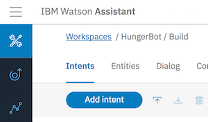
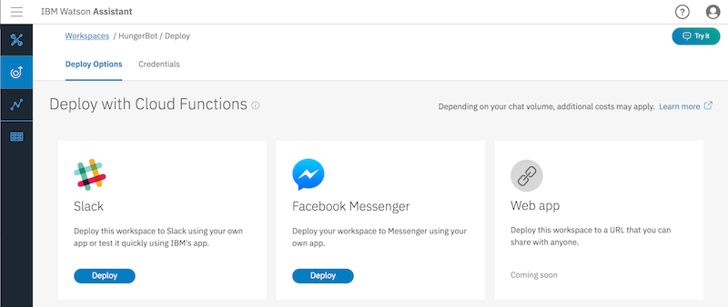
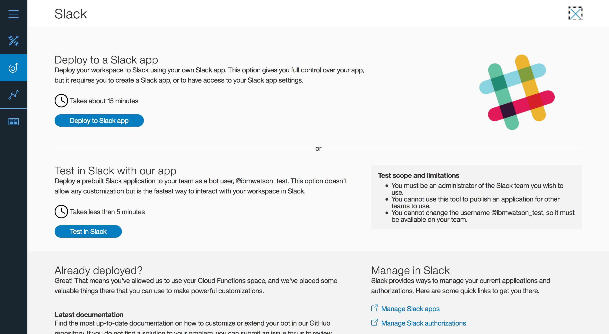
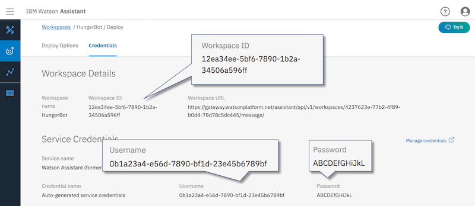
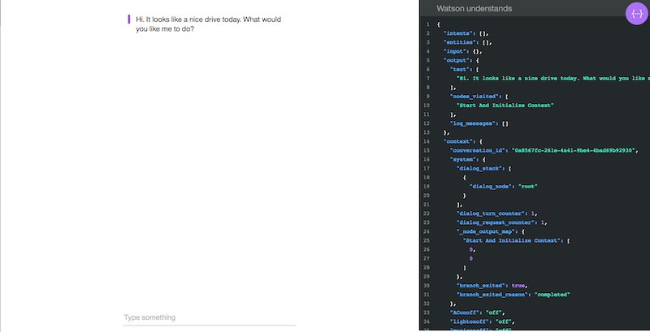

# Chatbot Workshop Resources

The following resources will help to train and deploy your chatbot to Slack.

## Train

Please refer to [this lab](training.md) to train Watson Assistant.

## Deploy to Slack

1. In the Watson Assistant tool, click on the **Deploy** icon in the left sidebar menu of the Watson Conversation tooling.

	

2. Click on **Deploy** under the tile labeled Slack.

	

3. Follow the instructions to create a Slack application. 

	

## Deploy to Node.js Application

A [sample Node.js application](https://github.com/watson-developer-cloud/assistant-simple) that uses a webbased chat interface is available in the Watson Developer Cloud on Github. 


1. Clone the repo:

    ```
    git clone https://github.com/watson-developer-cloud/assistant-simple
    ```
    
2. Follow the instructions to either run the application locally or in IBM Cloud. Add the Watson Assistant service credentials (username, password, and workspace ID) either in the .env file (locally), or bind the Watson Service to the IBM Cloud application.

    
    
    ```
    # .env file
    # Environment variables
    WORKSPACE_ID=<workspace-id>
    ASSISTANT_USERNAME=<conversation-username>
    ASSISTANT_PASSWORD=<conversation-password>
    ```

3. Run the application:

    ```
    npm start
    ```
    
4. Open a browser to the application and begin interacting with the chatbot.

    
    