# Watson Assistant Workshop Lab

<!-- TOC depthFrom:2 updateOnSave:false -->

- [Introduction to Watson Assistant](#introduction-to-watson-assistant)
- [Step 1: Sign up on IBM Cloud](#step-1-sign-up-on-ibm-cloud)
- [Step 2: Train Watson Assistant Service](#step-2-train-watson-assistant-service)
    - [Intents, Entities and Dialog](#intents-entities-and-dialog)
    - [Slots](#slots)
    - [Handlers](#handlers)
    - [Digressions](#digressions)
- [Step 3: Test Watson Assistant Service](#step-3-test-watson-assistant-service)
    - [Basic Dialog and Slots](#basic-dialog-and-slots)
    - [Digression](#digression)
    - [Handler](#handler)
- [Step 4: Deploy to Slack](#step-4-deploy-to-slack)
    - [Alternatively, Deploy to Node.js Application](#alternatively-deploy-to-nodejs-application)
- [Final Demo](#final-demo)
- [Summary](#summary)
- [License](#license)

<!-- /TOC -->

## Introduction to Watson Assistant

The Watson Assistant service combines machine learning, natural language understanding, and integrated dialog tools to create conversation flows between your apps and your users. In this lab, you will create a workspace and understand the terminology of creating a chatbot.

## Step 1: Sign up on IBM Cloud

Sign up on [IBM Cloud](http://ibm.biz/slackchatbot070918). If you already have an account, sign into your account.

## Step 2: Train Watson Assistant Service

### Intents, Entities and Dialog

1.  Click on the **Catalog** link in the top-right corner of the IBM Cloud dashboard.

2.  Select the **Watson Assistant** tile under the section titled Watson.

    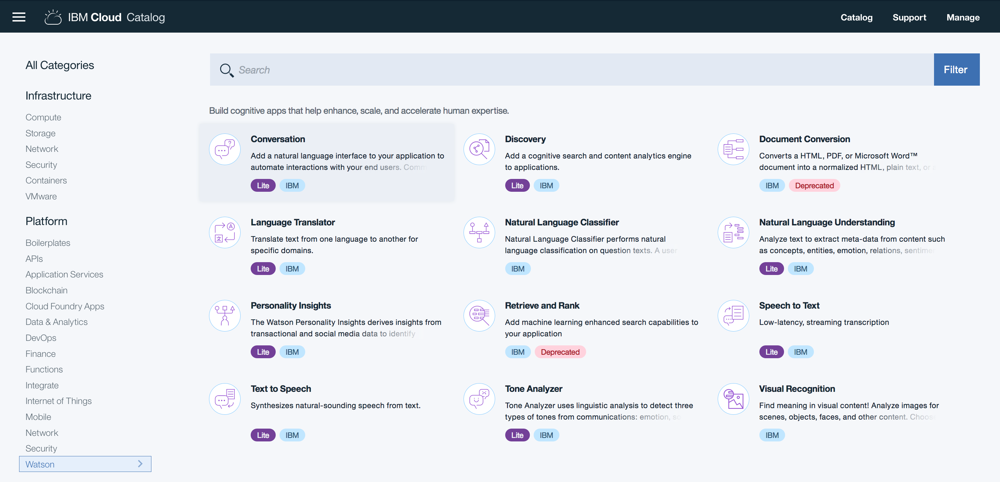

3.  You can choose a custom name for the service, or leave it as the default value. Select the region, organization, and space desired. Click on **Create**.

    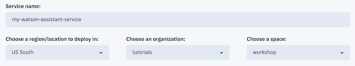

4.  Click on the **Launch tool** button to launch into the Watson Assistant tool.

    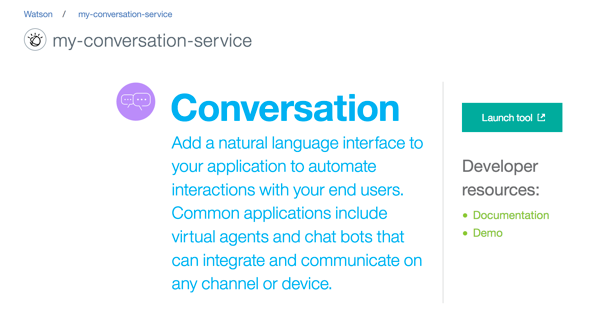

5.  This is the Watson Assistant tool where you can create workspaces and setup different chatbots dialogues and applications. Select the tab labeled **Workspaces**.

    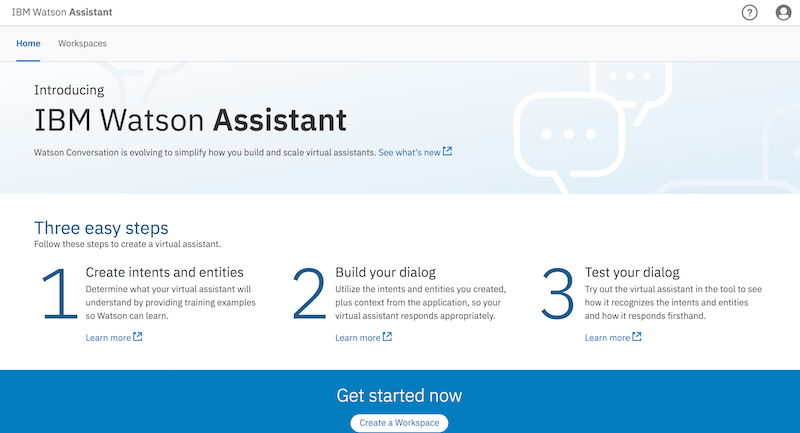

6.  There is an example Cognitive Car Dashboard workspace where you can see a more evolved training. However, we'll create a new workspace for our bot to use. Click on the **Create** button in the box labeled **Create a new workspace**.

    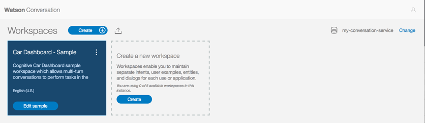

7.  Enter a name for the chatbot and a description. Click **Create** when finished.

    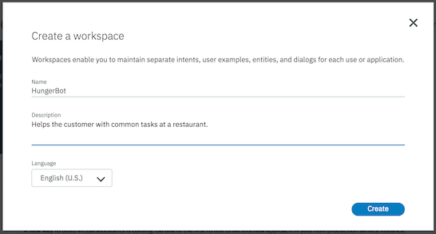

8.  You will be redirected into a page with three tabs: Intents, Entities and Dialog. Under the Intents tab, click **Add intent** to create the first intent.

    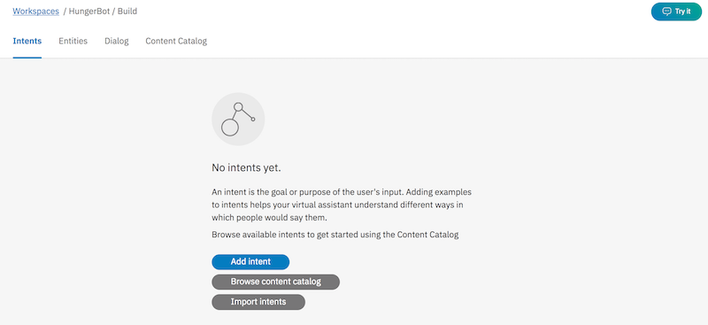

9.  Use the answers you wrote in Step 1 to create the first intent.

    

10. Click on the **Entities** tab in the top menu bar. This is where you can add entities. Add the entity you wrote in Step 1.

    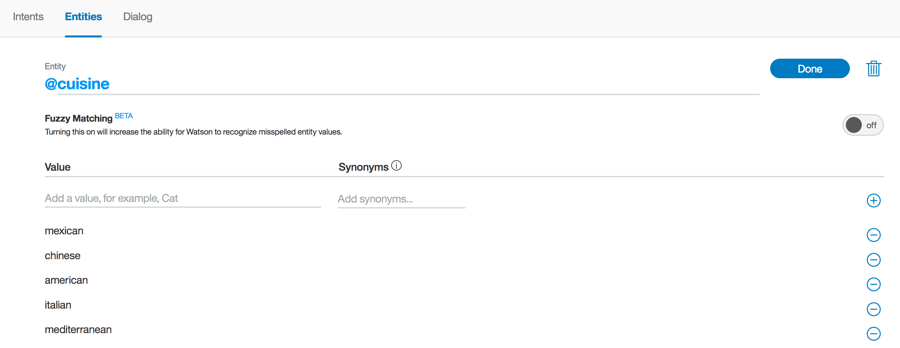

11. The Watson Assistant service has a handful of common entities created by IBM that can be used across any use case. These entities include: date, time, currency, percentage, and numbers. Click on **System entities**. Toggle on the switch for `@sys-time`, `@sys-date`, and `@sys-number` to enable the entities.

    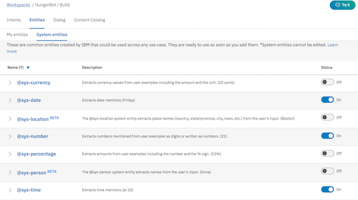

12. Click on the **Dialog** tab in the top menu bar. Click **Create**. There are two nodes added by default. The `welcome` condition is triggered when the chatbot is initially started. This is a good place to introduce the bot and suggest actions the user can ask of this chatbot.

    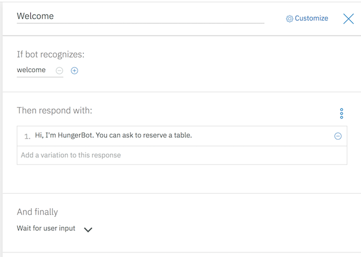

13. The second node checks for the condition `anything_else`. In the event the user enters something that wasn't expected, the service will return this response. Ideally, it should convey a way for the user to recover, such as example phrases.

    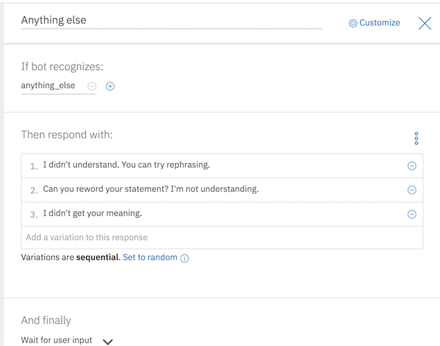

14. Return back to the `welcome` node and click on the three dots on the right side of the node. Select **Add node below** from the menu.

    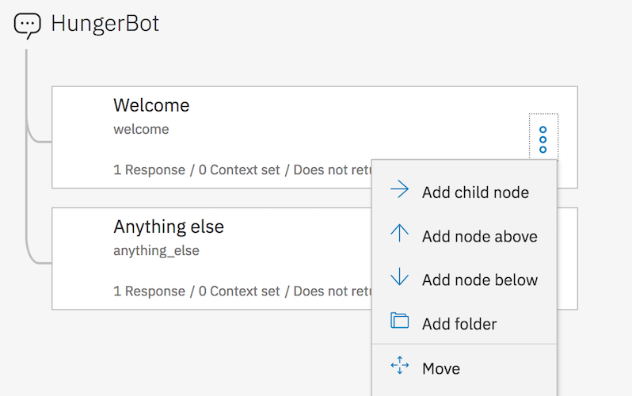

### Slots

15. Add a node to test the condition of the first intent you created, `#book_reservation`, as shown below. Click on **Customize** in the top right corner.

    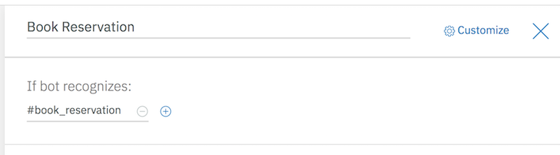

16. Toggle the slider labeled **Slots** and tick the box labeled **Prompt for everything**. Click **Apply**. Slots will help to gather multiple pieces of information needed in order to book a reservation.

    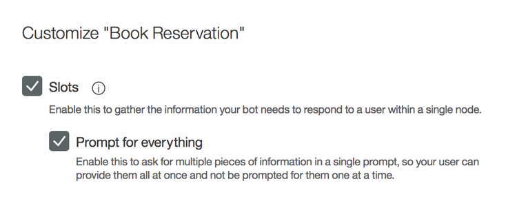

17. Add a slot for `@cuisine`, with the prompt:

    `What type of cuisine would you like?`

    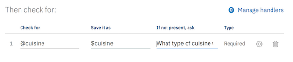

18. Add another slot for `@sys-date`, with the prompt:

    `What day would you like to reserve?`

    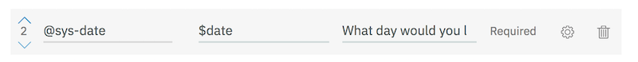

19. Add another slot for `@sys-time`, with the prompt:

    `What time would you like to reserve?`

    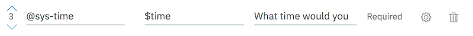

20. Add another slot for `@sys-number`, with the prompt:

    `How many people will be coming?`

    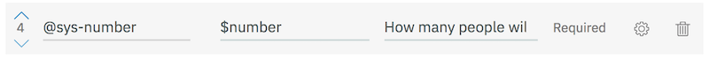

21. If no slots are prefilled, prompt the user to provide a cuisine:

    `Sure, I can help make a reservation. What type of cuisine did you want?`

    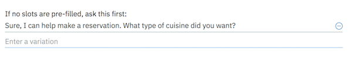

22. Have the bot respond with the details of the reservation:

    ```
    Great! I've booked a table for <? $number ?> people on <? $date ?> at <? $time ?> for <? $cuisine ?>.
    ```

    The <? … ?> syntax uses the values stored in the context and injects the values into the response.

    

### Handlers

23. Add a way out for the end user. Add a #Cancel intent.

    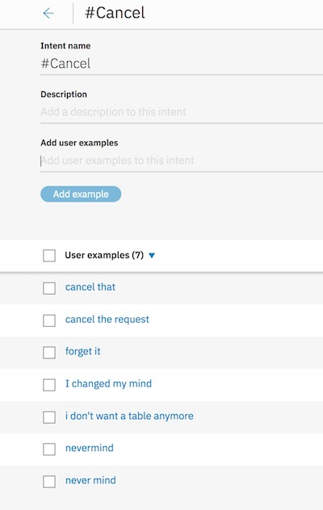

24. Go back to "book a reservation" node and open it. Click on "Manage Handlers"

25. Add the following handler for the #Cancel intent.

    `Okay, cancelling your request.`

    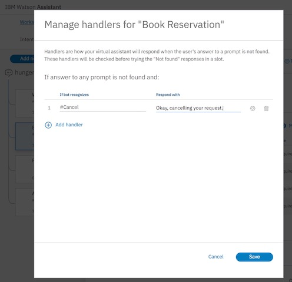

    Click on the gear icon to open the detail pane. Since the user is cancelling their reservation, we need to clear out the context variables for this conversation. Additionally, we ware setting the `$user_cancelled` variable for the next node to show the appropriate response.

    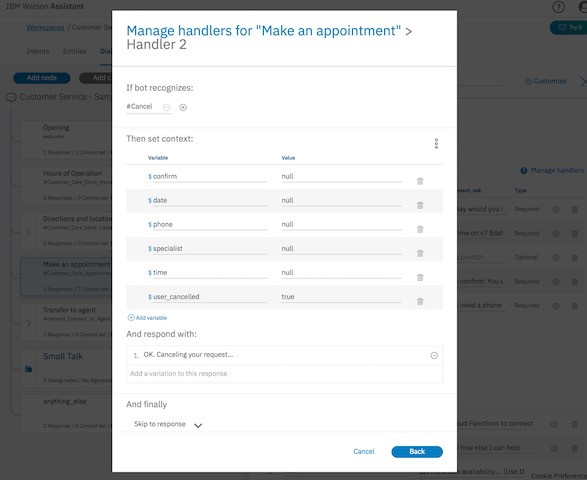

26) Back in the main node, change the response to the following:

    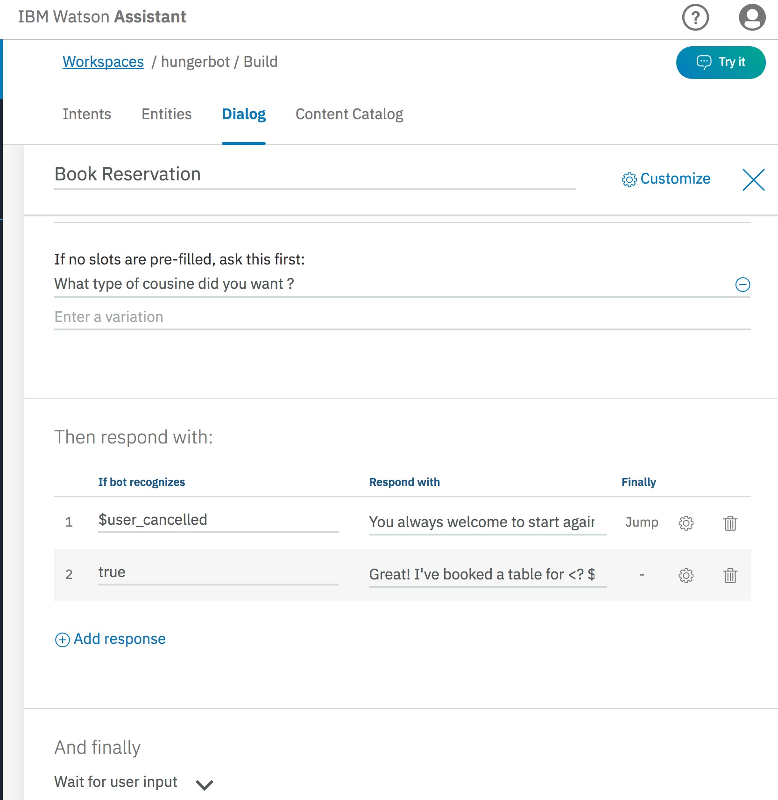

27) Jump to the welcome node in the detail of this response. This is so that we can start over again! Additionally, you must also set the `user_cancelled` variable back to `false`, so that the user is not kicked out unnecessarily in the next cycle.

    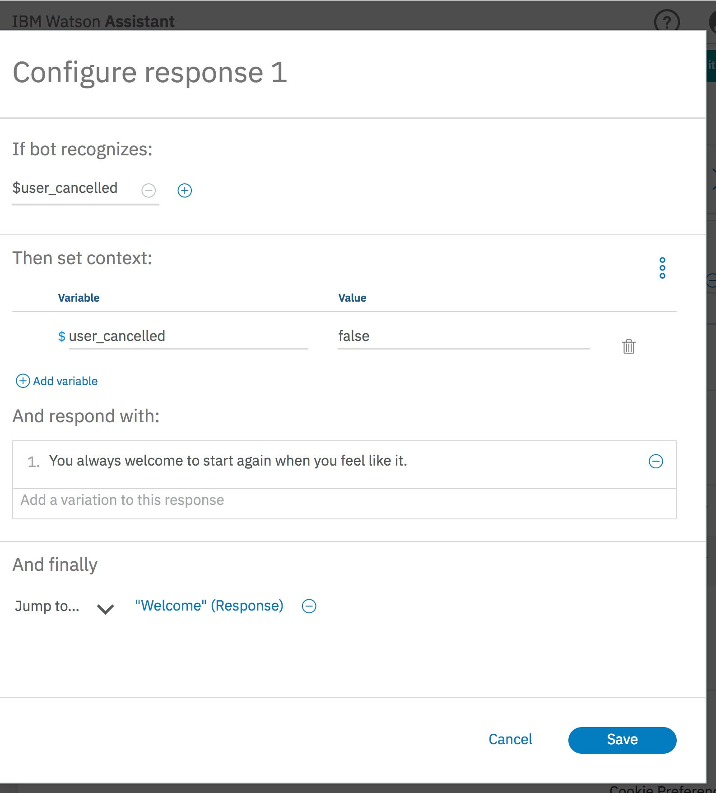

28) Here is a screenshot that tests the above steps:

    

### Digressions

29. Let's add a way for the user to ask FAQs while making a request or otherwise. We will first have to recognize what the user is asking for. Add an intent called `faq_cuisine_type` and give it the following examples:

    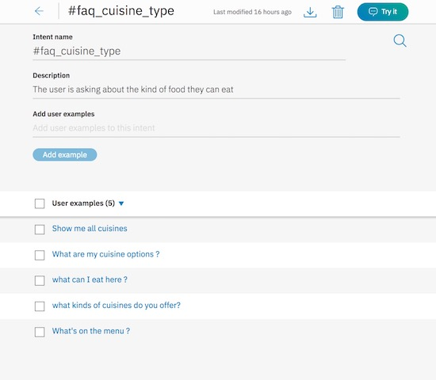

30. Next, add another intent called `faq_hours` and give it the following examples:

    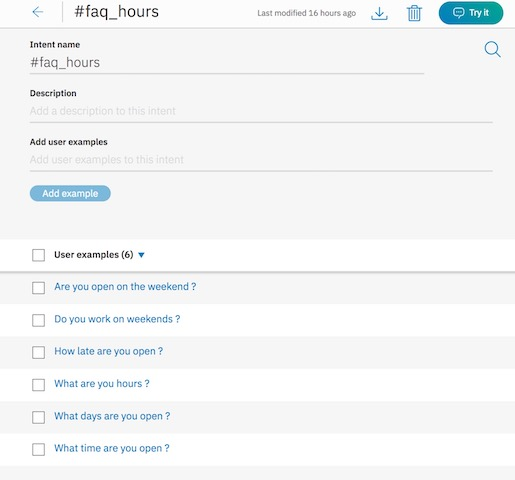

31. Add a folder called `FAQ` and two nodes under it called `FAQ cuisine` to answer questions about what type of cuisine we server and `FAQ Hours` to answer any questions about what times we are open.

    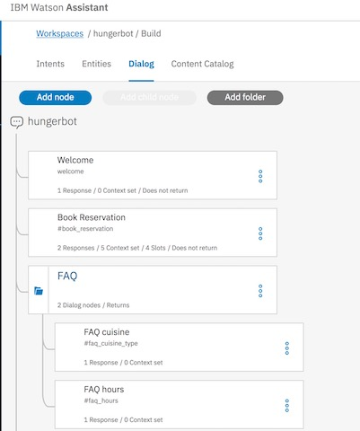

32. For the FAQ cuisine node, add `#faq_cuisine_type` to bot recognizes and add the following to respond with

    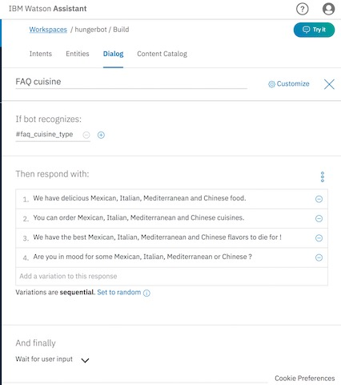

33. For the FAQ hours node, add `#faq_hours` to bot recognizes and add the following to respond with

    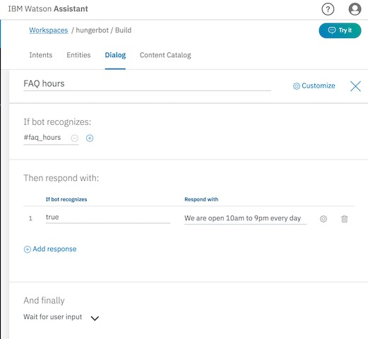

34. Back in the FAQ folder, allow digressions to come in and return in the `customize` settings

    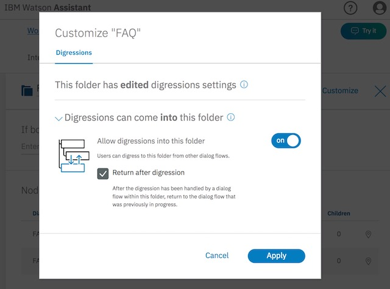

35. Here is the output of the Digressions section:

    

## Step 3: Test Watson Assistant Service

### Basic Dialog and Slots

The Watson Assistant tool offers a testing panel to test phrases to confirm the correct intents, entities, and dialog are matched and returned.

1.  To test the bot, click on the **Try It** button in the top-right corner of the tool.

    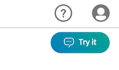

2.  A side panel appears and shows the response of the node that matches welcome. Enter a message that triggers the `#book_reservation` intent. We can ask `book a table`

    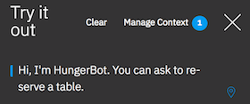

3.  Notice that the intent `#book_reservation` was recognized. The `#book_reservation` node was triggered and the output includes the response from the Book Reservation node. The user is prompted for a choice of cuisine.

    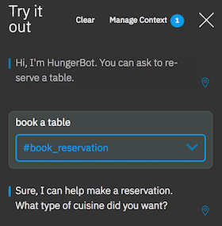

4.  When the user enters a cuisine, the `@cuisine` entity is recognized with a value `american`.

    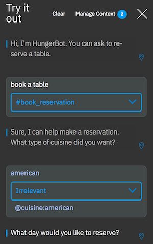

5.  When the user enters a date or time, Watson extracts out the value using the system entities `@sys-date` and `@sys-time`.

    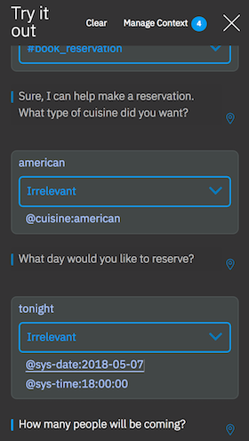

6.  Finally, when the user enters a number (either numerically or spelled out) for the number of people in the reservation, Watson extracts out the number using the system entity `@sys-number`.

    When all the required information (slots) is provided, the chatbot responds with a summary of the reservation. The provided valudes are injected into the response.

    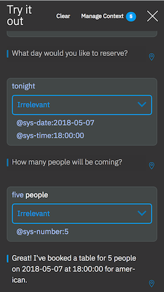

### Digression

0.  Click the clear button to clear the screen and clean up the context variables.

1.  Enter `Book a reservation`. The bot again identifies the correct intent and starts by trying to fill out the first `cuisine` slot.

    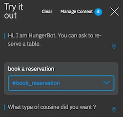

1.  Enter `What are my options ?`. The bot identifies this as a digression to the cuisine node based on the #faq_cuisine_type intent. It then asks for the cuisine information again.

    

1.  Enter `I would like to have Mexican at 5pm tomorrow. Please book a table for 4`. The bot finishes the task at this point.

    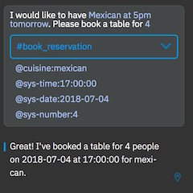

### Handler

0.  Click the clear button to clear the screen and clean up the context variables.

1.  Enter `Book a reservation`. The bot again identifies the correct intent and starts by trying to fill out the first `cuisine` slot.

    

1.  Type `Nevermind, I am not hungry anymore`. The bot recognizes the `Cancel` handler on the `#book_reservation` intent and cancels the whole request.

    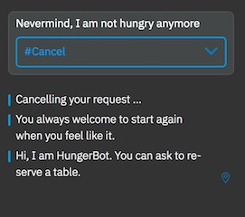

1.  It clears out the context variables as well.

    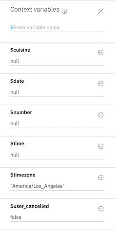

## Step 4: Deploy to Slack

1.  In the Watson Assistant tool, click on the **Deploy** icon in the left sidebar menu of the Watson Conversation tooling.

    

2.  Click on **Deploy** under the tile labeled Slack.

    

3.  Follow the instructions to create a Slack application.

    

### Alternatively, Deploy to Node.js Application

A [sample Node.js application](https://github.com/watson-developer-cloud/assistant-simple) that uses a webbased chat interface is available in the Watson Developer Cloud on Github.

1.  Clone the repo:

    ```
    git clone https://github.com/watson-developer-cloud/assistant-simple
    ```

2.  Follow the instructions to either run the application locally or in IBM Cloud. Add the Watson Assistant service credentials (username, password, and workspace ID) either in the .env file (locally), or bind the Watson Service to the IBM Cloud application.

    

    ```
    # .env file
    # Environment variables
    WORKSPACE_ID=<workspace-id>
    ASSISTANT_USERNAME=<conversation-username>
    ASSISTANT_PASSWORD=<conversation-password>
    ```

3.  Run the application:

    ```
    npm start
    ```

4.  Open a browser to the application and begin interacting with the chatbot.

        

    hello world

## Final Demo

[](https://www.youtube.com/watch?v=8c1JYL3aFRs)

## Summary

The Watson Assistant service was able to handle gathering multiple pieces of information, parsing the user input, and placing the values into a context that was used to inject into the response back to the user.

## License

© Copyright IBM Corporation 2018

IBM, the IBM logo and ibm.com are trademarks of International Business Machines Corp., registered in many jurisdictions worldwide. Other product and service names might be trademarks of IBM or other companies. A current list of IBM trademarks is available on the Web at &quot;Copyright and trademark information&quot; at www.ibm.com/legal/copytrade.shtml.

This document is current as of the initial date of publication and may be changed by IBM at any time.

The information contained in these materials is provided for informational purposes only, and is provided AS IS without warranty of any kind, express or implied. IBM shall not be responsible for any damages arising out of the use of, or otherwise related to, these materials. Nothing contained in these materials is intended to, nor shall have the effect of, creating any warranties or representations from IBM or its suppliers or licensors, or altering the terms and conditions of the applicable license agreement governing the use of IBM software. References in these materials to IBM products, programs, or services do not imply that they will be available in all countries in which IBM operates. This information is based on current IBM product plans and strategy, which are subject to change by IBM without notice. Product release dates and/or capabilities referenced in these materials may change at any time at IBM&#39;s sole discretion based on market opportunities or other factors, and are not intended to be a commitment to future product or feature availability in any way.

---
